## 安装Packet Capture

各大应用商店均有，我从Google商店下载的

顺便给你们提供一个下载地址

### [下载点我](http://nhdz.ml/packet%20capture.apk)

## 打开 Capture Capture

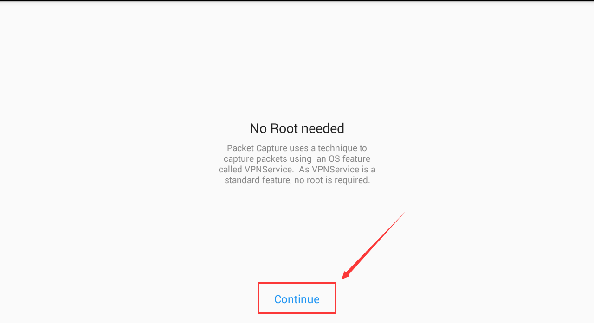

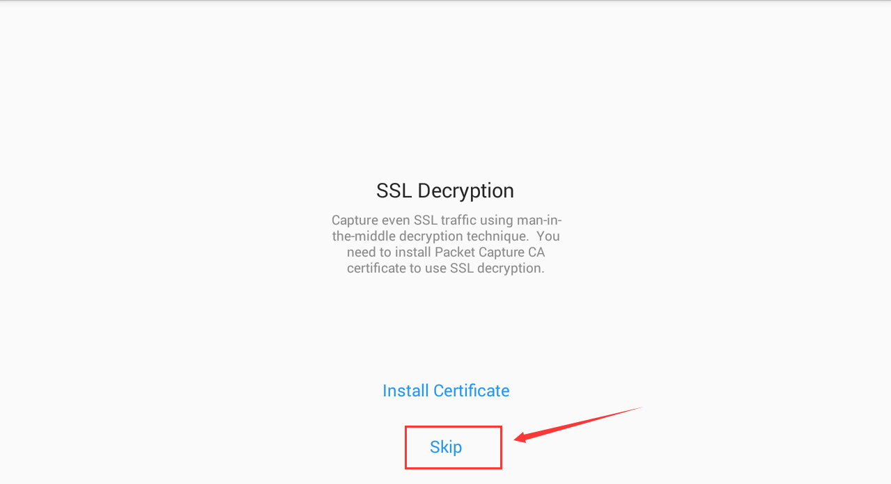

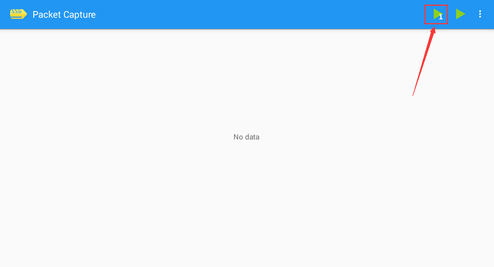

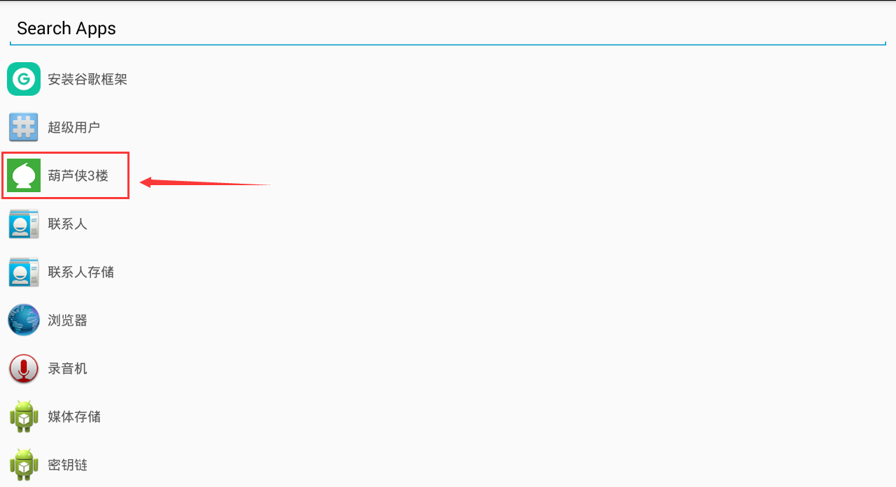

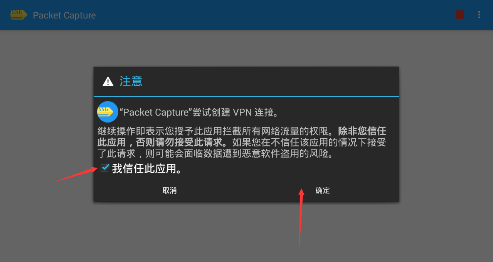

## 打开葫芦侠（葫芦侠三楼）

随便进入一个版块

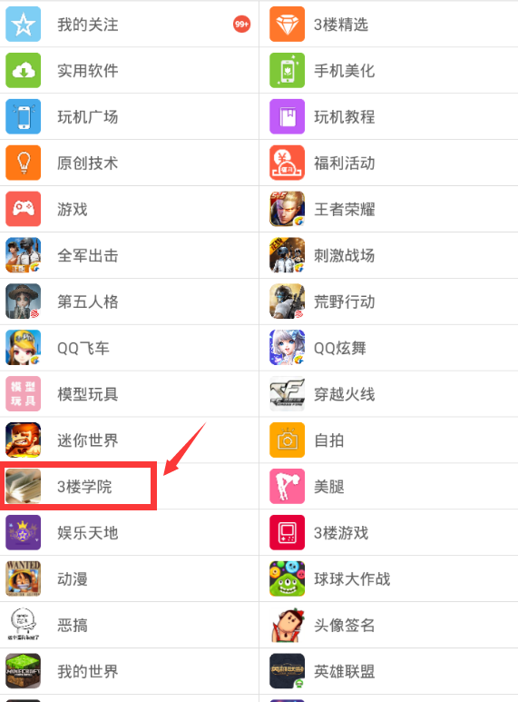

## 返回 Packet Capture

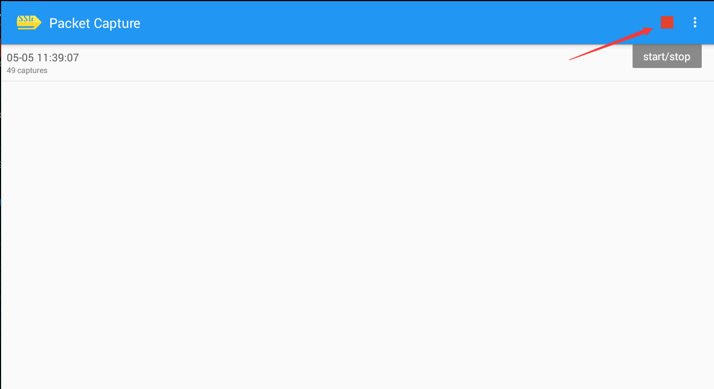

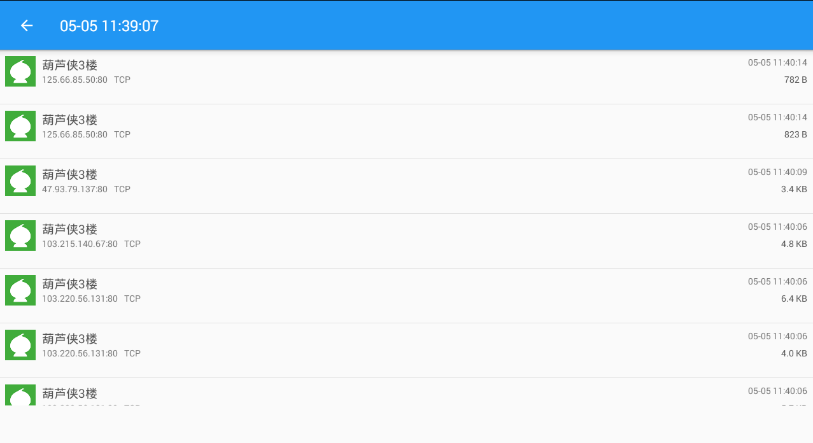

有很多的数据包

这时候就要自己点击进去慢慢找了

不过不要担心，很容易找到的

找到类似下面这种的数据包

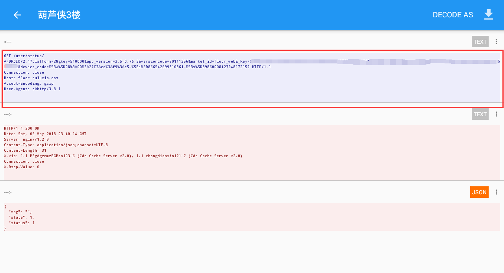

我打马赛克的部分就是我得`key`

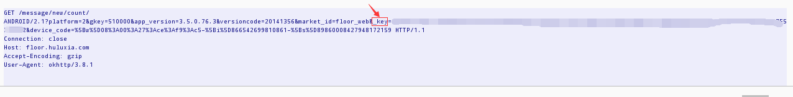

注意是 `_key` 后面的值一直到 `&` 结束,长为 **112**

再将我打马赛克的部分复制出来即可

访问 http://xiao-xi.tk/

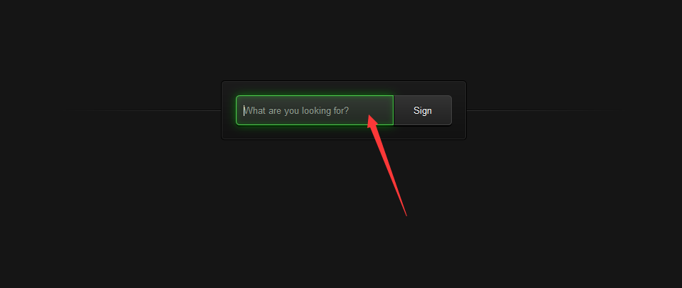

在箭头处粘贴你刚才复制的`key`的值即可

签到成功截图

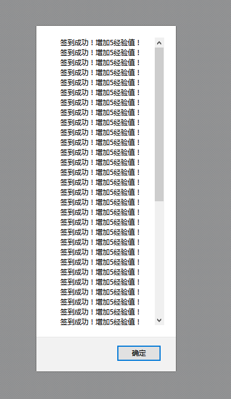

## PS

key 值只要葫芦侠没有注销重新登陆，是一直不会改变的，所以记下来以后可以使用
